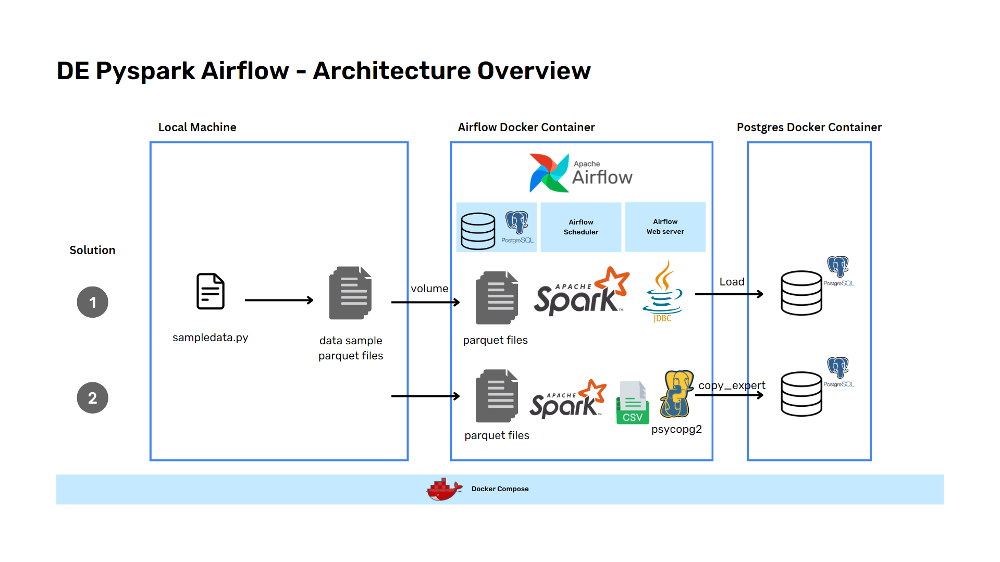
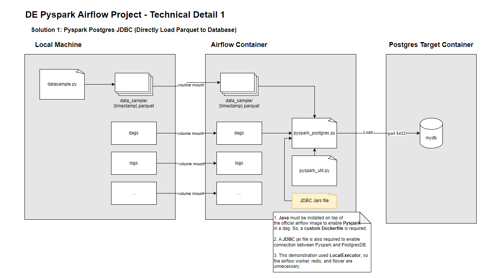
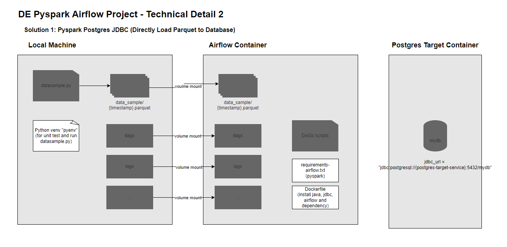
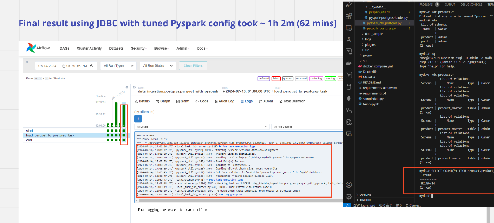
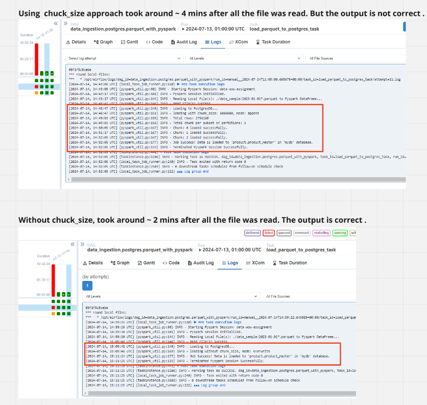
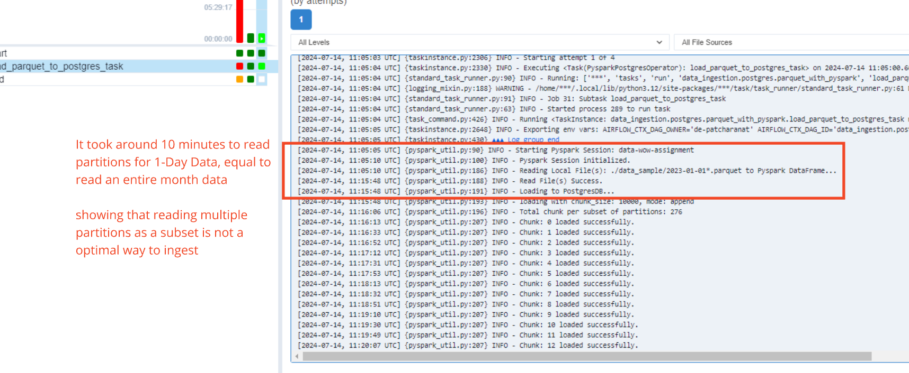
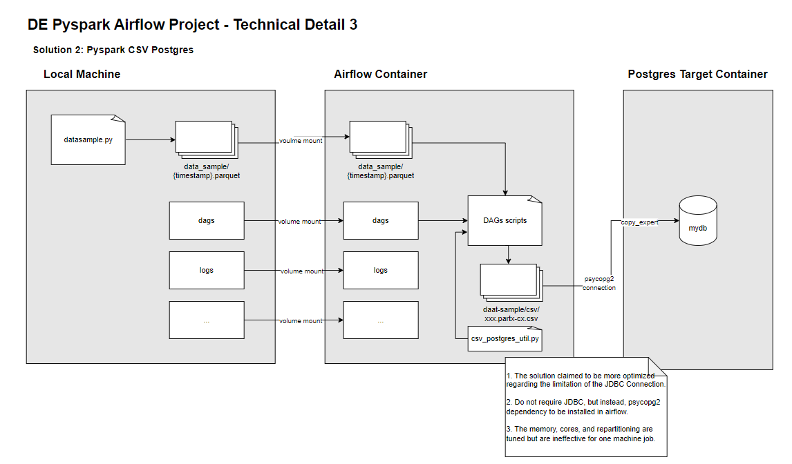
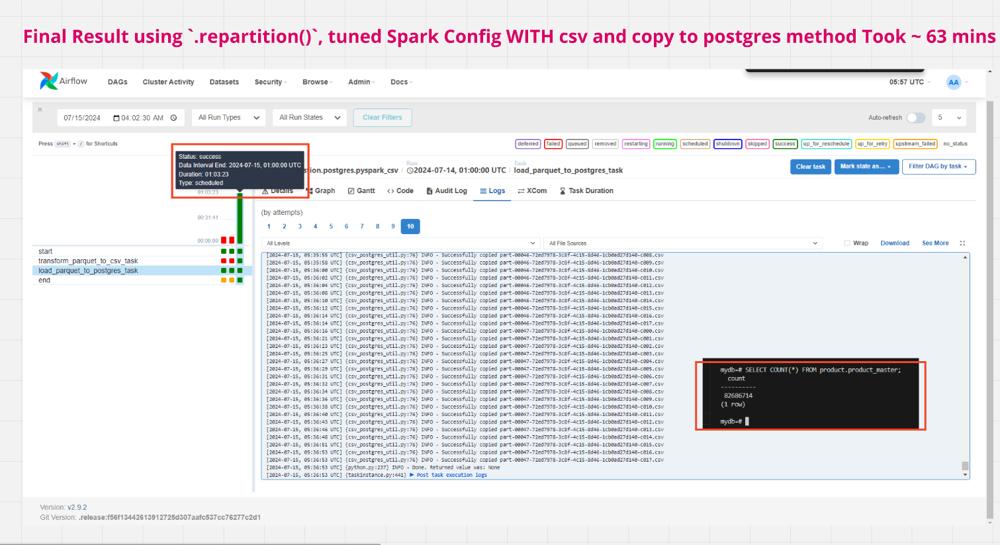
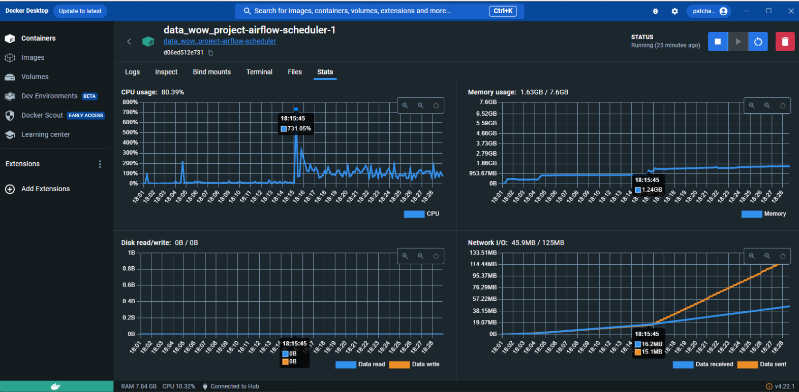

# DE-PySpark-Airflow
*patcharanat p.*

*First of all, I intended to remove mock data generator script and requirement detail to avoid reproducing full-process of this project due to confidentiality, but instead, mock data sample was uploaded*

Data Ingestion of local parquet files to docker postgresDB using PySpark tightly coupled with Airflow as custom operator orchestrated by docker-compose

## Overview


## Table of contents
1. [Preparing Environment](#1-prepare-environment)
2. [DAG Detail and Results](#2-dags-detail-and-results)
3. [References](#3-references)
4. [Demo](#4-demo)
5. [Appendix](#5-appendix)

## 1. Preparing Environment
*Please use `git bash` for window or `Terminal` for MacOS to make commands compatible with documentation.*

- Prerequisites Installation
    - Python
    - Docker Desktop

1. Prepare python environment for local development.
    ```bash
    python -m pyenv
    # or python3 -m pyenv
    # depends on your python installation

    source pyenv/Scripts/activate

    pip install -r requirements.txt
    ```

2. Airflow / Postgres

    **Airflow**

    In this project, I used the official [docker-compose.yml](https://airflow.apache.org/docs/apache-airflow/2.9.2/docker-compose.yaml) from Airflow and modified it to suit requirements including:
    - Changed `CeleryExecutor` to `LocalExecutor`, because we use a single machine running the job. So, `redis`, `flower`, and `airflow worker` are also unnecessary **AND** using `CeleryExecutor` locally might not improve in term of ingestion performance.
    - Used a custom image [Dockerfile](Dockerfile), because I needed to install some dependencies for using `Pyspark` in the job, `psycopg2` for postgres connection.
        - For detail in `Pyspark` installation, it required ***JAVA*** to be installed for spark availability, setting `JAVA_HOME` and also needed `JDBC` jar file to enable connection between spark session and postgres database.
        - For dependency of airflow, I packed everything into [requirements-airflow.txt](requirements-airflow.txt) which will be installed in every airflow-related container.
    - Modified volume mount path to mount `data_sample` folder containing all generated data parquet files, `dags`, and `logs` to be available for the job.
        - Since I didn't use data lake, so mounting data source into Airflow's container is necessary.
        - And mounting `dags` and `logs` enable us to see DAGs changes in real-time, so convenience in development :)


    **Postgres Database**

    In official [docker-compose.yml](docker-compose.yml) from Airflow, I extended it with a service called `postgres-target`, which is a target database that will be used in the project.
    - In first-time job run in '*Solution 2*', it appeared that it required *schema* to be pre-exists before loading data into the database. So, I created a script, [init_schema.sql](./src/init_script/init_schema.sql) to be executed when first the target posgres container spin-up. This will be mounted to postgres's container entrypoint also.

## 2. DAGs Detail and Results
This project introduced 2 solutions as the following:

1. Using Pyspark read all the parquet files and use `JDBC` jar file to make conenction with the target postgres database (port 5432) and load all at once (I tried loading with chunk approach and reading subsets of parquet files multiple times, but resulting in slower in performance)

    - There're custom DAGs written in OOP and very well documented in there I want to present it here :) [pyspark_postgres.py](./airflow/dags/pyspark_postgres.py), and [pyspark_util.py](./airflow/dags/utils/pyspark_util.py)
    - The `pyspark_postgres.py` is a main dag file using a custom operator considered as a util in `pyspark_util.py`
        - The overview process of Custom Operator, `PysparkPostgresJDBCOperator`, is initializing spark session with specified configuration, reading the parquet file, loading to the database, and terminating the session.

    #### Solution 1: Pyspark Postgres JDBC
    
    

    ***Solution 1 Result***
    

    *Chunk size seemed slower than loading at once*

    

    *And from the below picture, reading parquet files as subset is definitely not the optimal way to ingest*

    

2. Using Pyspark to read all the parquet files, and copying to targetpostgres database as chunks

    - There're also a custom DAG I want to present here :) [pyspark_csv_postgres.py](./airflow/dags/pyspark_csv_postgres.py), and [pyspark_util.py](./airflow/dags/utils/pyspark_util.py)
    - The `pyspark_csv_postgres.py` is a main dag file using a custom operator considered as a util in `pyspark_util.py`
        - The overview process of Custom Operator, `PysparkCSVOperator`, is initializing spark session with specified configuration, reading the parquet file, exporting to airflow' local container as csv files, and terminating the session.
        - `copy_csv_files_to_postgres` function is in the [csv_postgres_util.py](./airflow/dags/utils/csv_postgres_util.py) will be used with `PythonOperator` to load the file to target postgres database.

    #### Solution 2: Pyspark Postgres psycopg2 (COPY file)
    

    ***Solution 2 Result***
    

***Unfortunately, I couldn't ingest all the data within 30 miniutes. But the pipelines is functional and success to complete the task. However, it's possible to be scaled if we want to deploy it in production, and use multiple workers for parallel processing.***



***Closing remark**: Using `repartition()` without appropriate spark configuration tuning may lead to threads issue and inaccurate data ingestion. Tuning spark configuration by tuning memory, cores, and executor instances might not improve in performance for local processing. I presumed it related to limitation in running job locally in a single machine.*

## 3. References
- [How to speed up spark df.write jdbc to postgres databse | Stack Overflow](https://stackoverflow.com/questions/58676909/how-to-speed-up-spark-df-write-jdbc-to-postgres-database)
    - They recommended to use `COPY` method because '*This is the approach recommended as spark JDBC can't be tuned to gain higher write speeds due to connection constraints.*'
        - support thread: [How does COPY work and why is it so much faster than INSERT? | Stack Overflow](https://stackoverflow.com/questions/46715354/how-does-copy-work-and-why-is-it-so-much-faster-than-insert)
- [Python Postgres Package: psycopg2 copy_from vs copy_expert | Stack Overflow](https://stackoverflow.com/questions/64810090/python-postgres-package-psycopg2-copy-from-vs-copy-expert)
    - regarding to performance aspect, supported article: [Fastest Way to Load Data Into PostgreSQL Using Python | Haki Benita](https://hakibenita.com/fast-load-data-python-postgresql)
- [PySpark — The Factor of Cores | Medium](https://subhamkharwal.medium.com/pyspark-the-factor-of-cores-e884b2d5af6c)
    - for tuning `.repartition()` method and cores, and number of executor instances.

## 4. Demo
    
```bash
# install python venv
python -m venv pyenv
chmod +x pyenv/Scripts/activate
source pyenv/Scripts/activate

# generate data sample
python -m datasample.py

# spin-up containers
docker compose build
docker compose up

# go to local:8080 and run dags

# inspect data in postgres-target container
docker exec -it de-pyspark-airflow-postgres-target-1 bash
psql -U admin -d mydb
\dt # nothing should be shown 
\dn # schema should be shown
\dt product.* # nothing should be shown before running dags
\dt product.* # table should be shown after running dags
SELECT COUNT(*) FROM product.product_master; # rows ingested should be shown
\q # leave psql
exit # leave postgres container

# inspect directory in airflow-scheduler container
docker exec -it de-pyspark-airflow-airflow-scheduler-1 bash
ls
exit

# termniate session
docker compose down -v
```

## 5. Appendix
*All the steps in this demo will be done without using `Makefile` to explicitly show the process*
1. Setting up Environment
    - We use a separate python environment to avoid dependencies conflict and make sure the project could run isolatedly from anyone's local environment.

2. Quickrun
    ```bash
    # quick python venv
    make venv
    source pyenv/Scripts/activate

    # docker compose build then up
    make build-start
    
    # get in to airflow-scheduler container commandline
    make bash-postgres-target

    # get in to postgres-target container commandline
    make bash-postgres-target

    # Stop all containers and delete volumes
    make stop
    ```
---